<p align="center">
  
</p>

# Awesome Order Management System (OMS) Ecosystem 🚀📦

<p align="center">
  <a href="https://github.com/ishandutta2007/Awesome-Awesome-Awesome"></a><a href="https://discord.gg/jc4xtF58Ve"></a>
  <a href="https://github.com/ishandutta2007/Awesome-Order-Management-System/stargazers"></a>
  <a href="https://github.com/ishandutta2007/Awesome-Order-Management-System/network/members"></a>
  <a href="https://github.com/ishandutta2007/Awesome-Order-Management-System/issues"></a>
  <a href="https://github.com/ishandutta2007/Awesome-Order-Management-System/blob/main/LICENSE"></a>
  <a href="https://github.com/ishandutta2007/Awesome-Order-Management-System/pulls"></a>
  <a href="https://github.com/ishandutta2007"></a>
</p>

---

## 🌟 Overview & Market Context

A curated catalog of **SaaS platforms** and **open-source repositories** for **Order Management Systems (OMS)**, **Distributed Order Management (DOM)**, and **Enterprise Retail Fulfillment**.

Modern commerce demands seamless multi-channel orchestration: capturing orders across marketplaces, social commerce, and web storefronts, allocating inventory in real-time across regional warehouses and brick-and-mortar stores, executing Buy-Online-Pick-Up-In-Store (BOPIS), ship-from-store, or drop-shipping, and efficiently managing reverse logistics.

> 📊 **Market Insights & Fragmentation**: The global Order Management System (OMS) market is valued at **~$3.8B - $4.5B (2025/2026)** and is projected to expand to **$8.5B+ by 2032** (CAGR ~11.5%). The sector is **moderately fragmented**: mega-cap enterprise software giants (Salesforce, IBM, Manhattan Associates) dominate high-complexity, multi-node Tier-1 retail, while specialized mid-market SaaS providers and high-growth composable/headless open-source engines capture dedicated vertical niches, preventing a single winner-take-all monopoly.

---

## 📑 Table of Contents

- [☁️ Enterprise SaaS Platforms](#-enterprise-saas-platforms)
- [💻 Open-Source GitHub Projects](#-open-source-github-projects)
- [🧩 Architecture & Key Capabilities](#-architecture--key-capabilities)
- [🤝 How to Contribute](#-how-to-contribute)
- [⭐ Star History](#-star-history)
- [📜 Disclaimer & License](#-disclaimer--license)

---

## ☁️ Enterprise SaaS Platforms

Below is a curated comparison of leading SaaS Order Management platforms, sorted by **Company Scale (Market Capitalization / Valuation / Revenue)** in descending order.

| Product | Company Scale (Valuation / Revenue) | Description & Focus | Starting Pricing | Free Tier / Free Trial Limits |
| :--- | :--- | :--- | :--- | :--- |
| 🌐 **[Salesforce Order Management](https://www.salesforce.com/)** | **~$290B Market Cap** (NYSE: CRM, ~$38B+ Annual Rev) | Enterprise DOM integrated directly with Salesforce Commerce & Service Cloud ecosystems for global omnichannel customer journeys. | Order Visibility Edition starts at 0.25% of GMV; Growth Edition starts at 1.0% of GMV (billed annually) | 30-day free trial via Salesforce Commerce Cloud / Starter Suite trial; custom enterprise OMS sandbox on request |
| 🏢 **[IBM Sterling Order Management](https://www.ibm.com/products/sterling-order-management)** | **~$220B Market Cap** (NYSE: IBM, ~$62B+ Annual Rev) | Battle-tested enterprise OMS with deep configurability for complex, global multi-node fulfillment networks and B2B/B2C retail operations. | Essentials starts at ~$0.028/order line/mo; Standard starts at ~$0.045/order line/mo | No permanent free plan; custom architectural discovery sandbox demo on request (0 days self-serve) |
| 🏬 **[Manhattan Active Order / OMS](https://www.manh.com/)** | **~$16B Market Cap** (NASDAQ: MANH, ~$1.05B+ Annual Rev) | Enterprise unified commerce and cloud-native order management solution tightly coupled with Manhattan’s supply-chain and POS systems. | Starts at ~$3,000/mo (enterprise licensing scaled by store nodes and order volume) | No permanent free plan; tailored interactive POC and product demo upon request (0 days self-serve) |
| 📊 **[Brightpearl](https://www.brightpearl.com/)** | **~$13B Market Cap (Parent Sage Group)** ($360M Acquisition) | Retail operating system combining order management, multi-channel inventory, and accounting tailored for growing brands ($1M+ GMV). | Starts at ~$375/mo (billed annually; scales with order volume and connected channels) | No permanent free plan; 1-on-1 personalized workflow walkthrough and TSP upon request (0 days self-serve) |
| 🔄 **[Cin7](https://www.cin7.com/)** | **~$1.0B Valuation** (~$100M+ ARR, backed by Rubicon) | Cloud inventory and order management platform built for fast-scaling multi-channel and multi-warehouse e-commerce sellers. | Core Standard starts at $349/mo (Pro at $599/mo, Advanced at $999/mo, billed annually) | 14-day free trial with full standard order routing and inventory feature access (no credit card required) |
| ⚡ **[Fluent Commerce](https://fluentcommerce.com/)** | **~$500M Valuation** (~$100M+ Funding, Series C) | Cloud-native distributed order management platform focused on flexible orchestration, BOPIS, ship-from-store, and high-volume retail. | Starts at ~$15,000/mo ($180,000/yr) based on order volume and velocity tiers | No permanent free plan; guided POC demo environment available on request (0 days self-serve) |
| 🧩 **[Kibo Commerce](https://kibocommerce.com/)** | **~$500M Valuation** (Vista Equity Partners Portfolio) | Composable commerce and distributed order management platform supporting real-time inventory visibility and unified customer experiences. | Starts at ~$1,667/mo ($20,000/yr) based on order lines processed tiers | 60-day free trial / sandbox POC access for prospective enterprise buyers and partners upon request |
| 📦 **[Extensiv OMS](https://www.extensiv.com/)** | **~$400M Valuation** (Marlin Equity Partners Portfolio) | Multi-channel order, inventory, and warehouse management capabilities built for high-growth brands and 3PL fulfillment networks. | Integration Manager starts at $39/mo; Order Manager (Skubana) starts at ~$399/mo | 30-day free trial on Integration Manager (first month free); guided demo sandbox on Order Manager |
| 📱 **[NewStore](https://www.newstore.com/)** | **~$300M Valuation** (~$150M+ Total Funding) | Mobile-first omnichannel platform engineered for store associate enablement, mobile POS, and unified digital order orchestration. | Modular connector bundles start at ~$1,667/mo ($20,000/yr); full platform from ~$4,167/mo ($50,000/yr) | No permanent free plan; guided retail tech stack demo and workflow assessment upon request (0 days self-serve) |
| 🌏 **[Anchanto](https://www.anchanto.com/)** | **~$120M Valuation** (~$30M+ Total Funding) | Omnichannel order and warehouse management platform with strong footprint and marketplace integrations across Asia-Pacific and Europe. | Starts at ~$250/mo (entry tier scaled by monthly processed order volume and sales channels) | No permanent free plan; customized live sandbox demo and onboarding assessment on request (0 days self-serve) |

---

## 💻 Open-Source GitHub Projects

Open-source commerce engines and dedicated OMS frameworks empower engineering teams to retain 100% data ownership, eliminate per-order SaaS fees, and build bespoke routing engines.

The projects below are sorted by **GitHub Star Count** in descending order.

1. 🐍 **[Odoo](https://github.com/odoo/odoo)** [](https://github.com/odoo/odoo/stargazers)  
   Comprehensive open-source ERP suite (Python/JavaScript) with mature sales order orchestration, multi-warehouse inventory management, delivery routing, and invoice lifecycle management.

2. 🛒 **[WooCommerce](https://github.com/woocommerce/woocommerce)** [](https://github.com/woocommerce/woocommerce/stargazers)  
   The world's most widely deployed open-source commerce framework (PHP/WordPress) with extensive extensions for order management, split shipping, and multi-channel fulfillment.

3. 💼 **[ERPNext](https://github.com/frappe/erpnext)** [](https://github.com/frappe/erpnext/stargazers)  
   Full-featured modern open-source ERP and OMS platform built on the Frappe framework (Python/JS), featuring comprehensive order tracking, pick/pack/ship workflows, drop-shipping, and multi-location inventory.

4. ⚡ **[Medusa](https://github.com/medusajs/medusa)** [](https://github.com/medusajs/medusa/stargazers)  
   Modular, headless open-source commerce platform (Node.js/TypeScript) with powerful primitives for order orchestration, inventory reservations, automated fulfillment pipelines, and customizable workflows.

5. 🛍️ **[Bagisto](https://github.com/bagisto/bagisto)** [](https://github.com/bagisto/bagisto/stargazers)  
   Laravel-based open-source e-commerce ecosystem featuring multi-inventory sources, order lifecycle tracking, channel routing, and administrative fulfillment portals.

6. 🦄 **[Saleor](https://github.com/saleor/saleor)** [](https://github.com/saleor/saleor/stargazers)  
   Composable, GraphQL-first open-source commerce engine (Python/Django) supporting complex multi-channel order processing, multi-warehouse stock allocation, and real-time webhook automations.

7. 💎 **[Spree Commerce](https://github.com/spree/spree)** [](https://github.com/spree/spree/stargazers)  
   Battle-tested open-source headless commerce and order processing framework (Ruby on Rails) featuring split shipments, return merchandise authorizations (RMA), and customizable order state machines.

8. 📦 **[InvenTree](https://github.com/inventree/InvenTree)** [](https://github.com/inventree/InvenTree/stargazers)  
   Modern open-source Inventory and Order Tracking System (Python/Django/React) providing real-time stock monitoring, sales/purchase order handling, supplier management, and barcode scanning.

9. 🔷 **[nopCommerce](https://github.com/nopSolutions/nopCommerce)** [](https://github.com/nopSolutions/nopCommerce/stargazers)  
   Leading ASP.NET Core open-source commerce platform offering comprehensive B2B/B2C order management, multi-store dispatching, warehouse management, and automated shipping workflows.

10. 🌲 **[Vendure](https://github.com/vendurehq/vendure)** [](https://github.com/vendurehq/vendure/stargazers)  
    Headless commerce and order management engine built with TypeScript & NestJS, featuring custom order state machine processes, configurable fulfillment handlers, and multi-channel inventory.

11. 🦅 **[Sylius](https://github.com/Sylius/Sylius)** [](https://github.com/Sylius/Sylius/stargazers)  
    Modular PHP/Symfony commerce framework engineered with clean code architecture, offering state machine-driven order workflows, multi-channel support, and flexible shipping strategies.

12. 🛡️ **[Solidus](https://github.com/solidusio/solidus)** [](https://github.com/solidusio/solidus/stargazers)  
    Enterprise-grade, community-driven commerce and order management platform (Ruby on Rails) built for high scalability, complex order modifications, and granular fulfillment state tracking.

13. 🏬 **[Shopware](https://github.com/shopware/shopware)** [](https://github.com/shopware/shopware/stargazers)  
    Open-source enterprise headless e-commerce and order management suite (Symfony/Vue.js) with dynamic rule builder automations, flow engines, and multi-inventory routing.

14. ☕ **[Apache OFBiz](https://github.com/apache/ofbiz)** [](https://github.com/apache/ofbiz/stargazers)  
    Enterprise-grade open-source ERP and distributed order management system (Java) providing comprehensive order promising, multi-facility routing, drop-ship fulfillment, and accounting reconciliation.

15. 🗃️ **[OpenOMS](https://github.com/openoms-org/openoms)** [](https://github.com/openoms-org/openoms/stargazers)  
    Dedicated microservices-based open-source Order Management System designed specifically for multi-channel e-commerce merchants, packaging workflows, and carrier routing.

---

## 🧩 Architecture & Key Capabilities

When architecting a modern Order Management System, systems typically implement the following core capabilities:

```
                  ┌────────────────────────────────────────┐
                  │          Omnichannel Channels          │
                  │  (Web, Mobile App, POS, Marketplaces)  │
                  └───────────────────┬────────────────────┘
                                      │
                                      ▼
                  ┌────────────────────────────────────────┐
                  │       Distributed OMS Engine Core      │
                  │  - Global Inventory Visibility (ATP)   │
                  │  - Smart Order Routing & Sourcing Logic│
                  │  - Split-Shipment & Safety Stock Rules │
                  │  - Payment Capture & Fraud Check       │
                  └───────────────────┬────────────────────┘
                                      │
         ┌────────────────────────────┼────────────────────────────┐
         ▼                            ▼                            ▼
┌──────────────────┐        ┌──────────────────┐        ┌──────────────────┐
│ Warehouse / 3PL  │        │ Store Pickup     │        │ Vendor Dropship  │
│ Pick, Pack, Ship │        │ (BOPIS / Curbside)│       │ Direct dispatch  │
└──────────────────┘        └──────────────────┘        └──────────────────┘
```

1. **Available-To-Promise (ATP) Inventory**: Real-time aggregate inventory views across distribution centers, stores, and suppliers with buffer allocation.
2. **Intelligent Sourcing Rules**: Dynamic order routing based on proximity, lowest shipping cost, warehouse capacity, and split minimization.
3. **Omnichannel Fulfillment (BOPIS & Ship-from-Store)**: Turning physical retail outlets into active mini-fulfillment centers.
4. **Returns & Reverse Logistics**: Streamlined RMA generation, store drop-off, restocking, and automated refund triggers.

---

## 🤝 How to Contribute

1. 🍴 Fork the repository.
2. 📝 Add or update an entry in [`README.md`](README.md).
3. 🔍 Ensure descriptions are factual, links point directly to official sites/repos, and pricing/trial terms are explicitly stated.
4. 🚀 Submit a Pull Request with a brief explanation.

---

## ⭐ Star History

[](https://star-history.dera.page/#ishandutta2007/Awesome-Order-Management-System&type=date&legend=top-left)

---

## 📜 Disclaimer & License

- This is a **community-curated** list intended for educational, architectural, and comparison purposes.
- Order management sits at the core of business revenue, inventory accuracy, and customer experience. Conduct thorough performance testing, load benchmarking, and SLA evaluations prior to production rollout.
- Distributed under the [MIT License](LICENSE).
